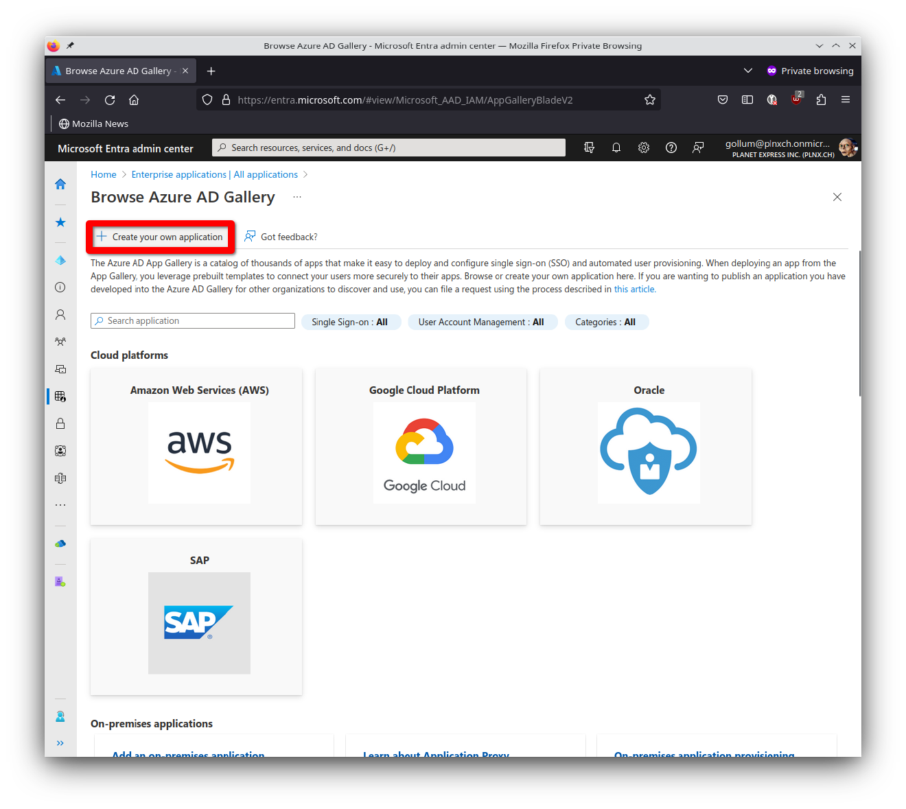
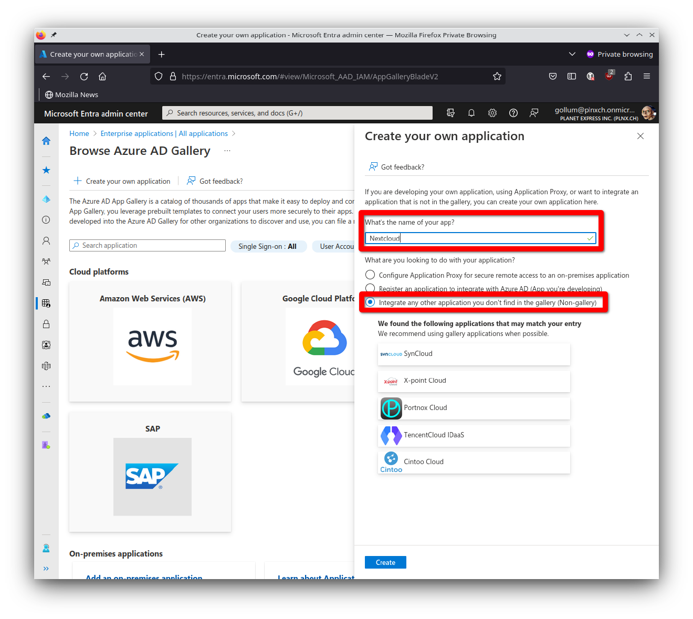
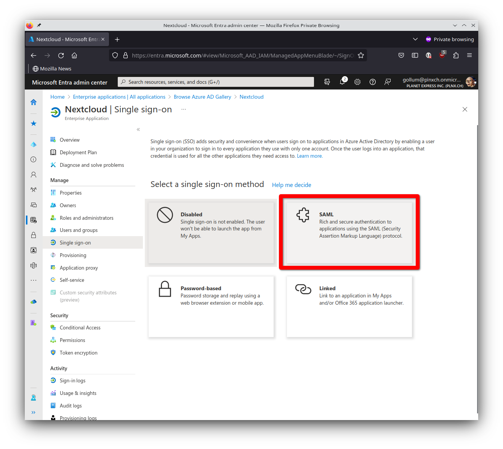
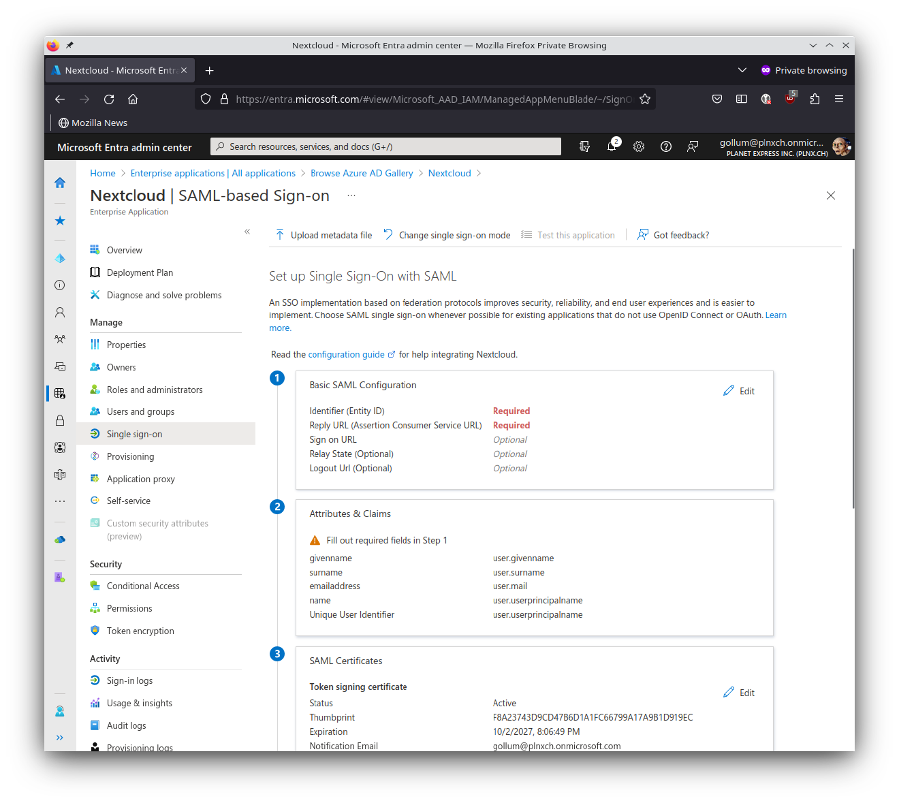
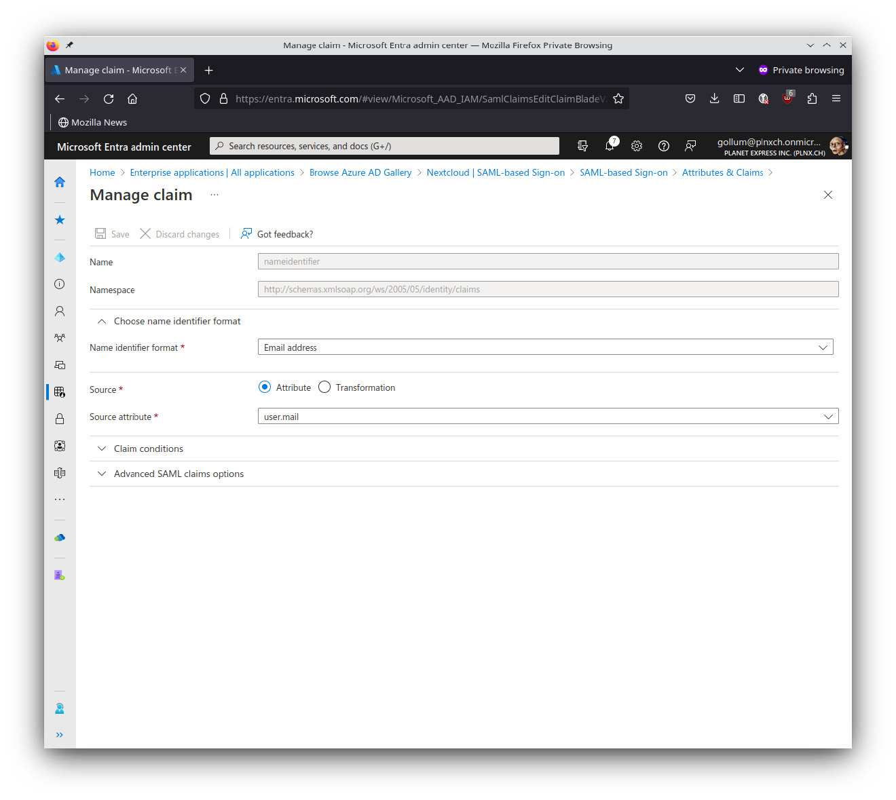
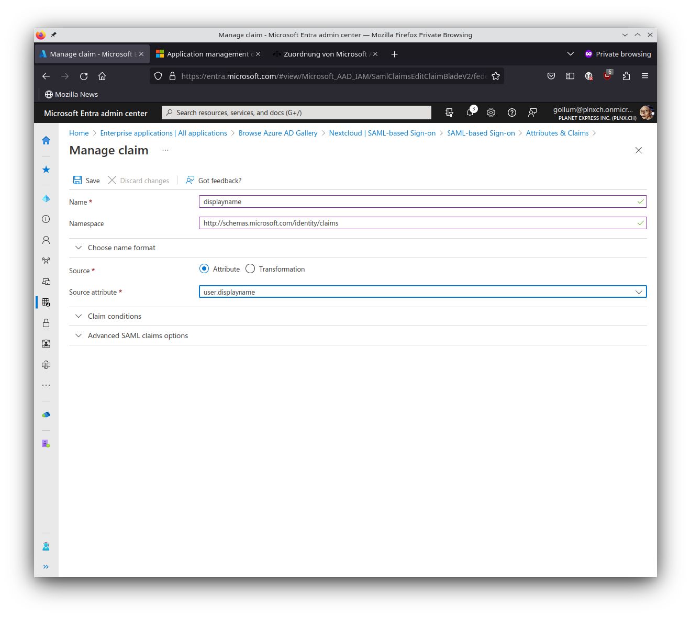
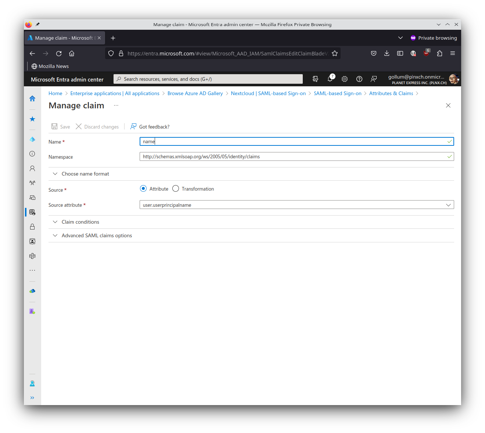
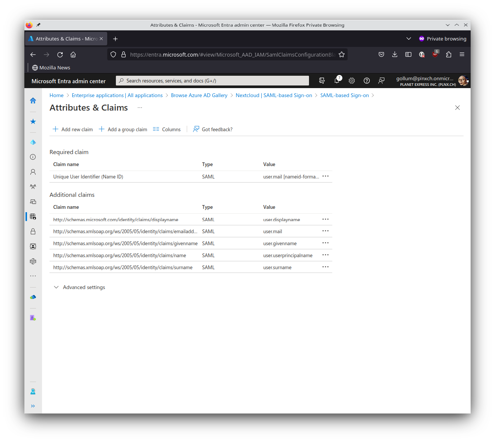

sudo adduser next
sudo usermod -aG sudo next
cp -r /root/.ssh/ /home/next/.ssh/

## Intall Docker
### Add Docker's official GPG key:
sudo apt-get update
sudo apt-get install ca-certificates curl
sudo install -m 0755 -d /etc/apt/keyrings
sudo curl -fsSL https://download.docker.com/linux/ubuntu/gpg -o /etc/apt/keyrings/docker.asc
sudo chmod a+r /etc/apt/keyrings/docker.asc

### Add the repository to Apt sources:
echo \
  "deb [arch=$(dpkg --print-architecture) signed-by=/etc/apt/keyrings/docker.asc] https://download.docker.com/linux/ubuntu \
  $(. /etc/os-release && echo "$VERSION_CODENAME") stable" | \
  sudo tee /etc/apt/sources.list.d/docker.list > /dev/null
sudo apt-get update


sudo apt-get install docker-ce docker-ce-cli containerd.io docker-buildx-plugin docker-compose-plugin

### Linux post-installation steps for Docker Engine
sudo groupadd docker
sudo usermod -aG docker $USER
newgrp docker

sudo systemctl enable docker.service
sudo systemctl enable containerd.service


### Настройка SSO
https://sekureco42.ch/posts/nextcloud-sso-with-azure-active-directory/#setup-nextcloud-for-sso


## Setup Enterprise Application in Azure Active Directory
### Create Enterprise Application
To be able to setup SSO with AAD we have to create an Enterprise Application with corresponding SAML authentication enabled.

Log into Entra Portal https://entra.microsoft.com/ 
under Applications select Enterprise applications
Hit New application
Hit Create your own application (there is no pre-defined application for Nextcloud)

Create your own application.

Fill in following information
What’s the name of your app? Nextcloud
What are you looking to do with your application? Integrate any other application you don't find in the gallery (Non-gallery)
Hit on Create



### Assign Users and/or Groups
Only assigned users and/or groups can use this application. So you have to assign corresponding users/groups to this application.

Select Users and groups
Hit on Add user/group
Select appropriate user and/or group and hit Assign
Setup single sign-on method
Now we have to define the single sign-on method.

Select Single sign-on
Select SAML



Selecting single sign-on method SAML.


Set up Single Sign-On with SAML Overview.
Now we have to fill in the required information for SAML authentication according to the sections:

Basic SAML Configuration
Identifier: https://nextcloud.x-loud.com/apps/user_saml/saml/metadata
Reply URL (Assertion Consumer Service URL): https://nextcloud.x-loud.com/apps/user_saml/saml/acs with index 1
Sign on URL (Optional): https://nextcloud.x-loud.com/login
Relay State (Optional): (left it empty)
Logout Url (Optional): (left it empty)
Hit Save


Basic SAML settings for Nextcloud.
Attributes & Claims
First we have to change the existing required claim for Unique User Identifier:

Name: nameidentifier (can not be changed)
Namespace: http://schemas.xmlsoap.org/ws/2005/05/identity/claims (can not be changed)
Name identifier format: Email address
Source: Attribute
Source attribute: user.mail
Hit Save


Defined claim for nameidentifier (should be already defined as showed here).
I always try to stick to the defaults if possible. For the Nextcloud integration we have to add additional claims.

Name: displayname
Namespace: http://schemas.microsoft.com/identity/claims
Source: Attribute
Source attribute: user.displayname
Hit Save



Additional claim for displayname.
Next claim we have to define:

Name: name
Namespace: http://schemas.microsoft.com/identity/claims
Source: Attribute
Source attribute: user.userprincipalname
Hit Save
Note: Account mapping between AAD and Nextcloud will be done based on this attribute.



Additional claim for name which will be filled with user.userprincipalname.
Here you see the summary of all defined Attributes & Claims:



All defined Attributes & Claims.
SAML Certificates
Download here the Certificate in Base64 Format - we need it later when setting up Nextcloud for SSO.

The certificate looks like:

```
-----BEGIN CERTIFICATE-----
MIIC8DCCAdigAwIBAgIQMn0lYq4SvK5PdmCQ8sAzUzANBgkqhkiG9w0BAQsFADA0MTIwMAYDVQQD
EylNaWNyb3NvZnQgQXp1cmUgRmVkZXJhdGVkIFNTTyBDZXJ0aWZpY2F0ZTAeFw0yMzAyMjIxNjEy
...
6k/DHC106BMpVJk2rhRHYl/NzJOTWjvVbFZ0Z3UKIJFzJs6qUtpNMWlMLJar9lP0bAo+XNkZhX3o
HGfyxr17AAOAMbfN/c2g
-----END CERTIFICATE-----
```

Set up Nextcloud
Copy following URLs for later use when setting up Nextcloud for SSO:

Login URL: https://login.microsoftonline.com/0ae2e4bc-355f-4422-be74-bd55df366c42/saml2
Azure AD Identifier: https://sts.windows.net/0ae2e4bc-355f-4422-be74-bd55df366c42/
Note: Those URLs contains the tenantId (0ae2e4bc-355f-4422-be74-bd55df366c42). Use your URLs with your own tenantId!

Setup Nextcloud for SSO
Application installation
Now we have to prepare Nextcloud for SSO. By default Nextcloud is not able to do SSO - for this purpose we have to install a so called “App”. This are add-ons to extend functionality of Nextcloud.

Just go to the Menu in the top right corner and hit Apps.
Select Featured apps (on the left side)
Search for SSO & SAML authentication; hit there the button Download and enable (probably you get asked for your admin password)
nextcloud-apps-sso-and-saml-authentication2.png
Go to Apps, Featured Apps und Download and enable SSO & SAML authentication.
Just go to the Menu in the top right corner and hit Administration settings.
Search for SSO & SAML authentication in the Administration section
Hit on Use built-in SAML authentication
nextcloud-apps-sso-and-saml-setting-1.png
Activate Use built-in SAML authentication.
Setup Identity Provider
General
Attribute to map the UID to: http://schemas.xmlsoap.org/ws/2005/05/identity/claims/name
Optional display name of the identity provider: Azure AD
Service Provider Data
We don’t have to fill in any thing in this section.

Identity Provider Data
Identifier of the IdP entity (must be URI): https://sts.windows.net/0ae2e4bc-355f-4422-be74-bd55df366c42/ (value you saved for later use in section Set up Nexcloud in AAD).
URL Target of the IdP where the SP will send the Authentication Request Message: https://login.microsoftonline.com/0ae2e4bc-355f-4422-be74-bd55df366c42/saml2 (value you saved for later use in section Set up Nexcloud in AAD).
Expand optional Identity Provider settings:

Public X.509 certificate of the IdP: Paste in Public certificate of your Enterprise Application (value you saved for later use in section SAML Certificates in AAD).
Attribute mapping
Expand attribute mapping settings:

Attribute to map the displayname to: http://schemas.microsoft.com/identity/claims/displayname
Attribute to map the email address to: http://schemas.xmlsoap.org/ws/2005/05/identity/claims/emailaddress
Attribute to map the quota to: (left it empty)
Attribute to map the users groups to: (left it empty)
Attribute to map the users home to: (left it empty)
Security settings
We don’t have to fill in any thing in this section.

User filtering
We don’t have to fill in any thing in this section.

Saving config
Nextcloud will automatically save as soon as you leave a field.

Note: If you setup everything correctly you should see on the right side of the button Download metadata XML a green message Metadata valid.
To summarize here are all settings as screenshot:

nextcloud-apps-sso-and-saml-setting-summary-1.png
Nextcloud SSO Settings - Summary (1/4).
nextcloud-apps-sso-and-saml-setting-summary-2.png
Nextcloud SSO Settings - Summary (2/4).
nextcloud-apps-sso-and-saml-setting-summary-3.png
Nextcloud SSO Settings - Summary (3/4).
nextcloud-apps-sso-and-saml-setting-summary-4.png
Nextcloud SSO Settings - Summary (4/4).
Result
Your app “Nextcloud” is now listed in “MyApps” (https://myapps.microsoft.com/  ) and available for users like other applications with single sign-on.

result-myapps.png
Nextcloud available as app in https://myapps.microsoft.com/
Note: If you want to have administrative access to your Nextcloud instance use the following URL: https://nextcloud.x-loud.com/login?direct=1  - use here your admin user you defined during setup of your Nextcloud instance.
Accessing Nextcloud from https://myapps.microsoft.com/ 
How it looks like if you acccess Nextcloud from your “MyApps” portal page: